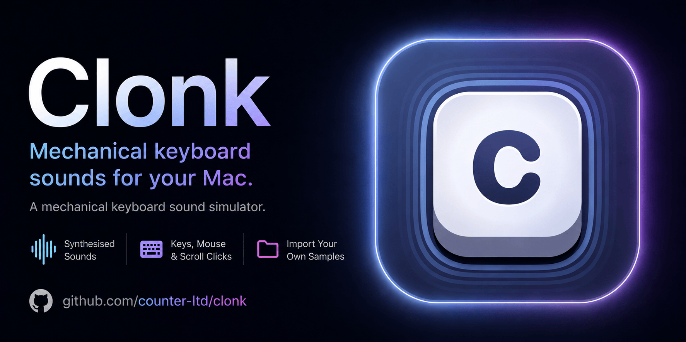
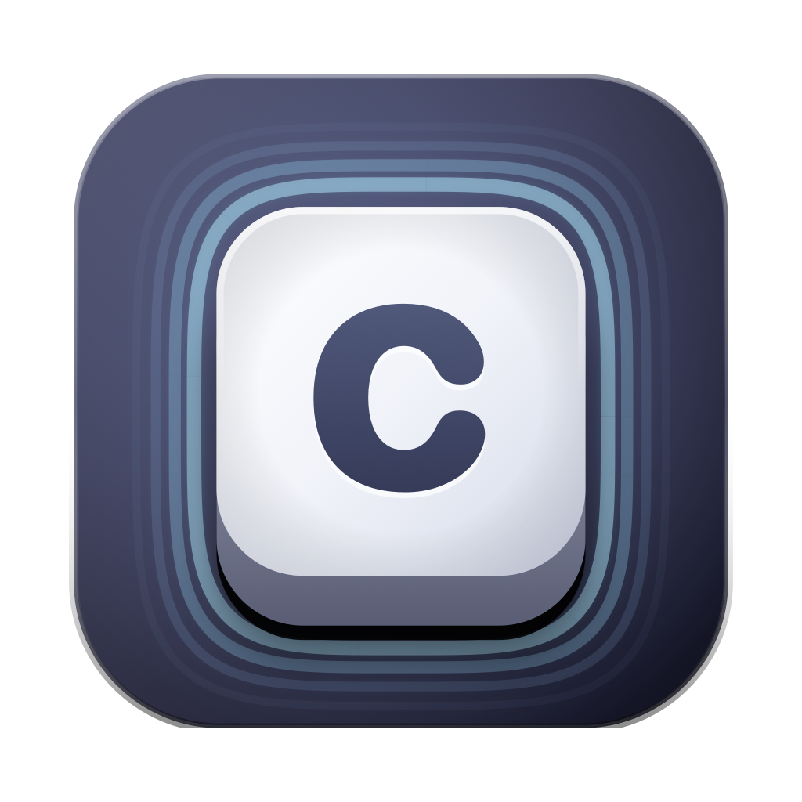
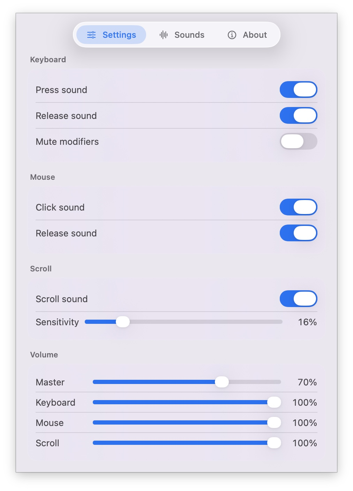
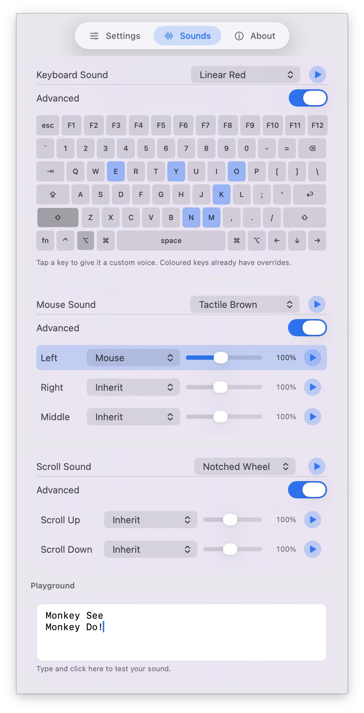

<div align="center">



<br>


<br><br>



# Clonk

**A mechanical keyboard sound simulator for your Mac.**


[](LICENSE.md)

5 synthesised switch voices · Key, mouse + scroll-wheel clicks · Release clicks · Import your own sample packs · Lives in the menu bar

</div>

---

> Inspired by [FunKey](https://apps.apple.com/us/app/funkey-mechanical-keyboard-app/id6469420677?mt=12) — a fun idea. This is the free, open-source alternative.

---

## What it is

Clonk gives every keystroke a satisfying mechanical click. It sits in the menu bar, listens for keys and mouse clicks, and plays a sound — and **every sound is generated live by DSP. There are no audio files in the app.**

A keypress is a short noise burst (the switch impact) driving two bandpass *resonators* (the keycap, plate and case body), summed with a bright high-passed *transient* (the contact click). Resonated noise reads as a real "thock" — not a musical tone. Each voice is a different recipe of those parameters in [`Theme.swift`](Sources/Clonk/Theme.swift).

Built natively in Swift for macOS Tahoe — menu-bar agent, no Dock icon.

<div align="center">

 

</div>

---

## Zero audio files

Clonk ships with no samples and no recordings. Every click is synthesised live from a handful of numbers. Clicks are pre-rendered once when a theme is selected; a keypress just picks a ready buffer and schedules it on the next free voice — cheap enough for the fastest typist.

---

## Voices

Five voices, each modelled on a real switch archetype:

| Voice | Feel |
|-------|------|
| **Clicky Blue** | Sharp, bright, audible click — Cherry MX Blue style |
| **Tactile Brown** | Balanced all-rounder — Cherry MX Brown style |
| **Linear Red** | Smooth, deep, soft, no click — Cherry MX Red style |
| **Deep Thock** | Low, rounded, premium gasket-mount thock |
| **Vintage Typewriter** | Loud, metallic high ping — buckling spring style |

Wide keycaps (space, return, shift, tab, delete) get a deeper voice. Every press is randomly detuned and levelled a touch so fast typing never sounds robotic, and release clicks auto-suppress while you type quickly. Turn on **key release sound** for the second half of a real mechanical keypress.

---

## Bring your own sounds

Clonk ships **zero audio files** — but you can import your own. A *sample pack* is just a folder of audio files (`wav`, `aiff`, `caf`, `mp3`, `m4a`, `flac`).

In the menu bar popover, **Keyboard Sound → Import Folder…**, pick a folder, and Clonk plays a random file from it on every keystroke. Packs are copied into `~/Library/Application Support/Clonk/SamplePacks/`.

---

## How it works

| File | Role |
|------|------|
| [`KeyMonitor.swift`](Sources/Clonk/KeyMonitor.swift) | Global `CGEventTap` — listen-only keyboard + mouse events |
| [`Synth.swift`](Sources/Clonk/Synth.swift) | DSP — turns theme parameters into PCM click buffers |
| [`SoundEngine.swift`](Sources/Clonk/SoundEngine.swift) | `AVAudioEngine` voice pool for polyphonic playback |
| [`Theme.swift`](Sources/Clonk/Theme.swift) | The synthesis presets |
| [`SamplePack.swift`](Sources/Clonk/SamplePack.swift) | User-imported sample pack loading |
| [`AppModel.swift`](Sources/Clonk/AppModel.swift) | Settings + wiring |

---

## Privacy

Clonk needs the macOS **Accessibility** permission to know *when* a key is pressed. It uses a listen-only event tap — it never modifies or swallows your input, and **it does not see, record, store, or transmit *what* you type.** Sound is synthesised on-device. Nothing leaves your Mac. No analytics · no tracking · no ads · no accounts · no network.

---

## Building

Requires **macOS 26 (Tahoe)** and a recent Swift toolchain.

```bash
make run      # build, bundle Clonk.app, launch it
make app      # build the .app bundle (with icon) into build/
make build    # just compile the release binary
make clean    # remove build artifacts
```

Clonk lives entirely in the menu bar — click its icon for the popover with every setting, a sound playground, and the Accessibility prompt (System Settings › Privacy & Security › Accessibility). Grant it, and start typing.

---

## Releases

Pushing to `main` builds the app and refreshes a rolling `latest` release via GitHub Actions. Pushing a `v*` tag publishes a versioned release.

---

## License

[Counter-Limitation License (CLL) v1.2](LICENSE.md) — free for individuals, learners, educators, researchers, artists, and small communities. Not for large corporations or profit extraction.
