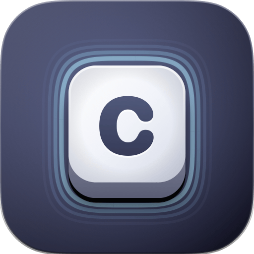
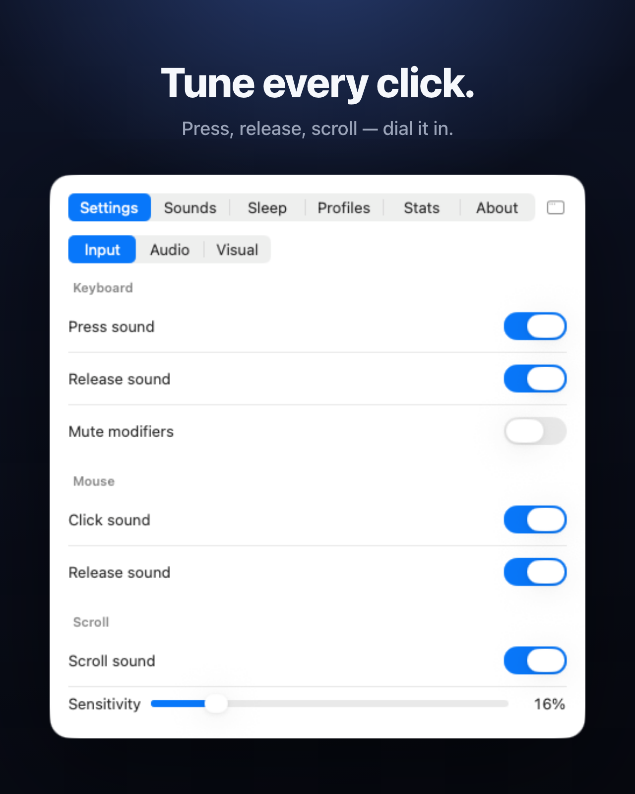
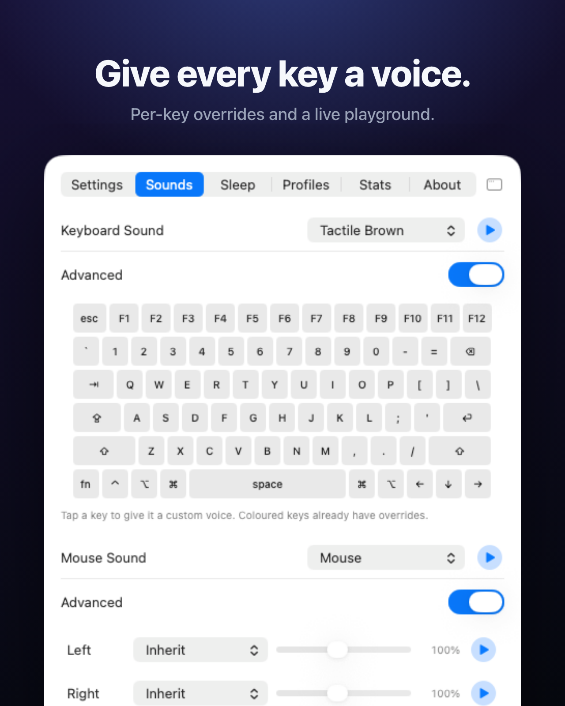
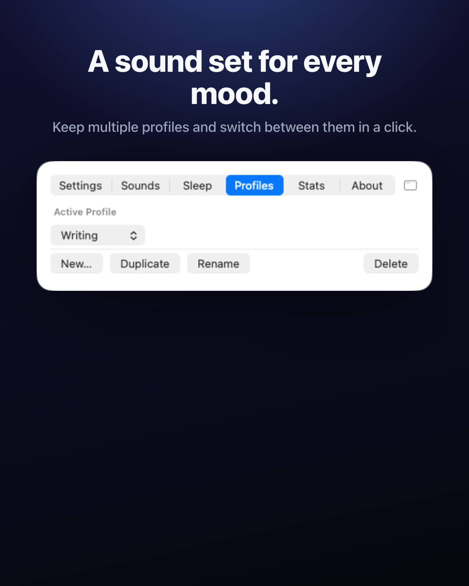
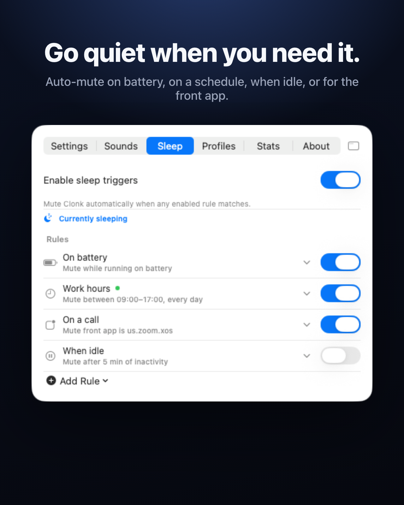
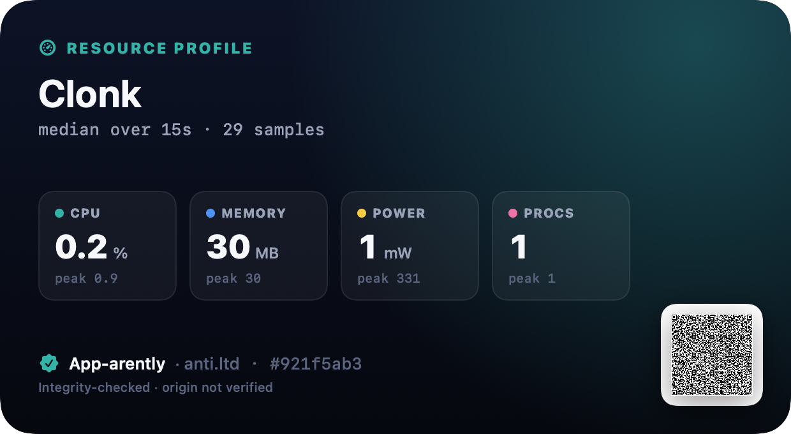
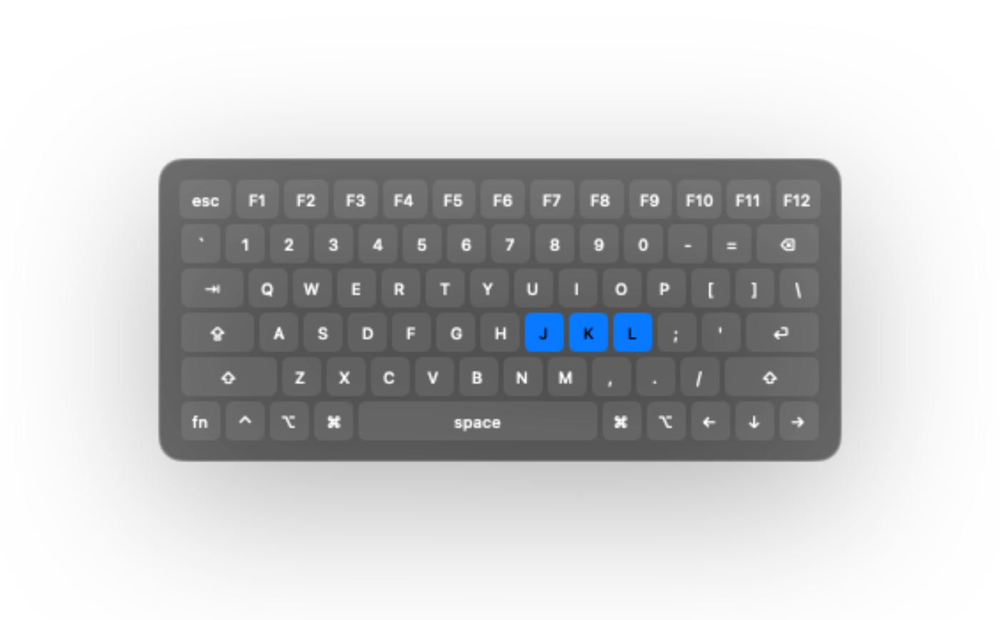
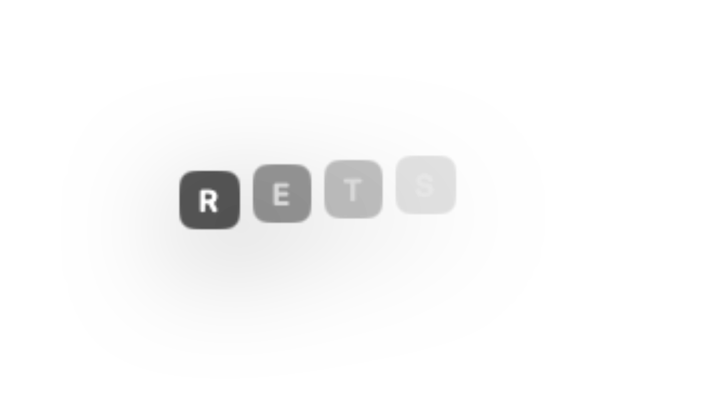
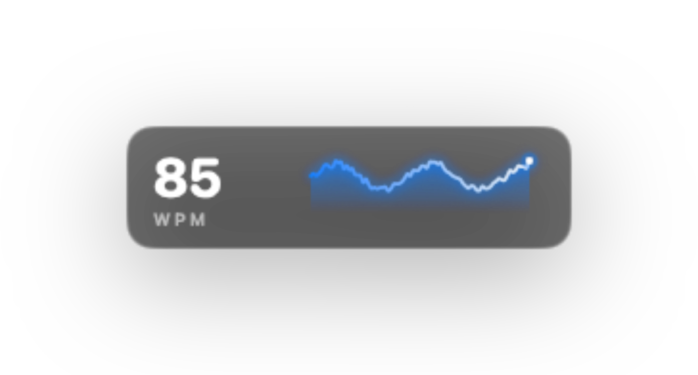
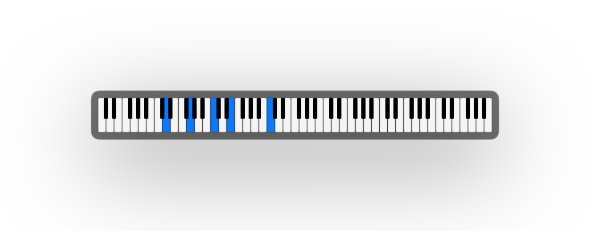

<div align="center">


<br>


<br><br>



# Clonk

**A mechanical keyboard sound simulator for your Mac.**


[](LICENSE.md)


`click · clack · clonk`

</div>

---

> Inspired by [Klack](https://apps.apple.com/gb/app/klack/id6446206067?mt=12
Klack), [FunKey](https://apps.apple.com/us/app/funkey-mechanical-keyboard-app/id6469420677?mt=12) — a fun idea. This is the free, open-source alternative.

---

## Screenshots

<div align="center">
 
</div>

<div align="center">
 
</div>

---

## Performance

<div align="center">

</div>

> Generated by `make screenshot` or `appstage art clonk` using [App-arently](../app-arently).

---

## What it is

Clonk gives every keystroke a satisfying mechanical click. It sits in the menu bar, listens for keys and mouse clicks, and plays a sound — and **every sound is generated live by DSP. There are no audio files in the app.**

A keypress is a short noise burst (the switch impact) driving two bandpass *resonators* (the keycap, plate and case body), summed with a bright high-passed *transient* (the contact click). Resonated noise reads as a real "thock" — not a musical tone. Each voice is a different recipe of those parameters in [`Theme.swift`](Sources/Clonk/Theme.swift).

Built natively in Swift for macOS Tahoe — menu-bar agent, no Dock icon.

---

## Zero audio files

Clonk ships with no samples and no recordings. Every click is synthesised live from a handful of numbers. Clicks are pre-rendered once when a theme is selected; a keypress just picks a ready buffer and schedules it on the next free voice — cheap enough for the fastest typist.

---

## Voices

Five voices, each modelled on a real switch archetype:

| Voice | Feel |
|-------|------|
| **Clicky Blue** | Sharp, bright, audible click — Cherry MX Blue style |
| **Tactile Brown** | Balanced all-rounder — Cherry MX Brown style |
| **Linear Red** | Smooth, deep, soft, no click — Cherry MX Red style |
| **Deep Thock** | Low, rounded, premium gasket-mount thock |
| **Vintage Typewriter** | Loud, metallic high ping — buckling spring style |

Wide keycaps (space, return, shift, tab, delete) get a deeper voice. Every press is randomly detuned and levelled a touch so fast typing never sounds robotic, and release clicks auto-suppress while you type quickly. Turn on **key release sound** for the second half of a real mechanical keypress.

---

## Bring your own sounds

Clonk ships **zero audio files** — but you can import your own. A *sample pack* is just a folder of audio files (`wav`, `aiff`, `caf`, `mp3`, `m4a`, `flac`).

In the menu bar popover, **Keyboard Sound → Import Folder…**, pick a folder, and Clonk plays a random file from it on every keystroke. Packs are copied into `~/Library/Application Support/counter-ltd/clonk/SamplePacks/`.

---

## On-screen overlays

Optional floating widgets that visualise what you type — drag them anywhere, or leave them off. Each is a transparent, draggable panel that floats above your work without stealing focus.

<div align="center">
<br>
<sub><b>Keyboard</b> — a floating layout that lights up with every press.</sub>
</div>

<div align="center">
 &nbsp;&nbsp; <br>
<sub><b>Minimal</b> — just the keys you're pressing, then they fade. &nbsp;·&nbsp; <b>WPM</b> — a live words-per-minute counter and sparkline.</sub>
</div>

<div align="center">
<br>
<sub><b>Piano</b> — map your keys to notes and play any app like an instrument.</sub>
</div>

---

## Profiles & quiet hours

**Profiles** keep a whole sound set under one name — a soft linear for writing, a sharp clicky blue for chat, your own sample pack for fun. Each profile remembers every setting (voices, volumes, overrides, overlays), and you switch between them in a click from the popover.

**Sleep rules** mute Clonk on their own when you don't want it. Mix and match conditions — on battery or low battery, within set hours, when a particular app is in front, while you're idle, on an external keyboard, during a calendar event, or with multiple displays attached. Set them once and forget them.

---

## How it works

| File | Role |
|------|------|
| [`KeyMonitor.swift`](Sources/Clonk/KeyMonitor.swift) | Global `CGEventTap` — listen-only keyboard + mouse events |
| [`Synth.swift`](Sources/Clonk/Synth.swift) | DSP — turns theme parameters into PCM click buffers |
| [`SoundEngine.swift`](Sources/Clonk/SoundEngine.swift) | `AVAudioEngine` voice pool for polyphonic playback |
| [`Theme.swift`](Sources/Clonk/Theme.swift) | The synthesis presets |
| [`SamplePack.swift`](Sources/Clonk/SamplePack.swift) | User-imported sample pack loading |
| [`AppModel.swift`](Sources/Clonk/AppModel.swift) | Settings + wiring |

---

## Privacy

Clonk needs the macOS **Accessibility** permission to know *when* a key is pressed. It uses a listen-only event tap — it never modifies or swallows your input, and **it does not see, record, store, or transmit *what* you type.** Sound is synthesised on-device. Nothing leaves your Mac. No analytics · no tracking · no ads · no accounts · no network.

---

## Building

Requires **macOS 26 (Tahoe)** and a recent Swift toolchain.

Clonk depends on **[iUX-MacOS](../iUX-MacOS)** — our shared UX layer (settings popover, menu-bar
host, overlay windows) — via a local path (`../iUX-MacOS`). Check it out as a sibling
directory before building:

```
Projects/
├── clonk/   ← this repo
└── iUX-MacOS/  ← shared macOS UX library
```

```bash
git clone git@github.com:anti-ltd/iUX-MacOS.git ../iUX-MacOS   # one-time: place iUX-MacOS beside clonk

make run      # build, bundle Clonk.app, launch it
make app      # build the .app bundle (with icon) into build/
make build    # just compile the release binary
make clean    # remove build artifacts
```

Clonk lives entirely in the menu bar — click its icon for the popover with every setting, a sound playground, and the Accessibility prompt (System Settings › Privacy & Security › Accessibility). Grant it, and start typing.

Codesigning uses a local `Clonk Dev` code-signing certificate if one exists in your keychain, otherwise it falls back to ad-hoc.

Clonk needs **Accessibility** access for its keyboard event tap. macOS ties that grant to the app's signing identity, and an ad-hoc signature changes on every rebuild — so you'd have to re-grant after each build. To make the grant stick, create a reusable self-signed `Clonk Dev` certificate once (Keychain Access → Certificate Assistant → Create a Certificate → type *Code Signing*); `make app` / `make run` pick it up automatically.
